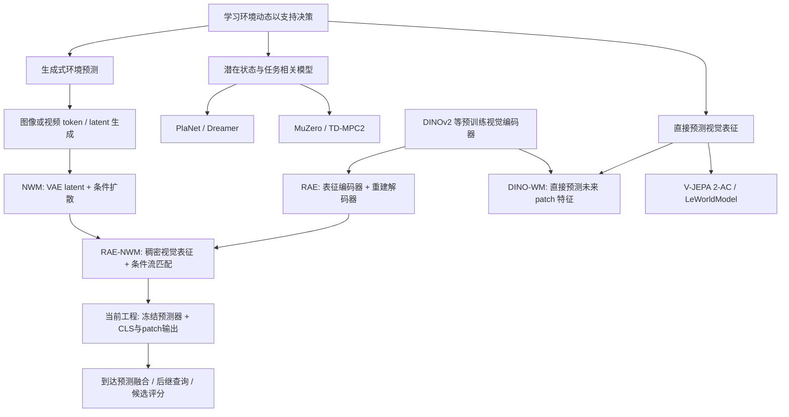

# 世界模型技术图谱与 B 小节写作分析

日期：2026-09-05。任务：广泛查阅世界模型路线，把当前工程接入的模型定位到技术路径中，再讨论相关工作 B 的组织。本文是研究笔记。初次研究未改正文，随后按用户确认完成 B 小节写作，见下方落稿记录。

## 1. 阅读范围

联网读取 23 篇原始论文的题名、摘要与版本页面，并通过 arXiv 的 `world models survey` 检索浏览近期综述目录。原始来源覆盖重建式潜在动态、任务相关隐式模型、视频生成、直接表征预测、物体/三维结构状态和导航世界模型；下面来源索引记录实际访问链接。浏览器连接两次超时后，使用公开 HTTP 页面完成检索与读取，没有依赖搜索摘要作模型分类。

另提取本地 NWM、RAE-NWM、DINO-WM、DINO-Foresight、LeWorldModel 的 PDF 文本，重点读 NWM §3、RAE-NWM §3–4、DINO-WM 的模型与训练部分；视觉检查 NWM 第 3 页及 RAE-NWM 第 5–6 页。当前工程的配置、模型加载、速度场损失、采样和下游输出均作了只读核对。没有执行模型前向、安装依赖或连接远端。

阅读深度有区别：23 篇均有原始网页依据，但并非全部逐式读完；核心定位由 RAE-NWM 原论文及当前工程配置共同支持。综述搜索是补充检索入口，本文的分类是为本稿构建的分析框架，不宣称为某篇综述的统一分类法。

## 2. 不能只按“生成图像 / 只预测 latent”二分

应分开三个问题：

| 维度 | 要回答的问题 | 典型选择 |
|---|---|---|
| 状态表示 | 环境用什么表示？ | 像素、压缩图像 latent、学习到的紧凑状态、预训练稠密视觉特征、物体状态、三维占据 |
| 动态学习 | 怎样从历史和条件预测未来？ | 循环状态转移、自回归预测、直接表征回归、扩散去噪、流匹配生成 |
| 决策使用 | 预测如何帮助行动？ | 生成模拟经验训练策略、潜在空间轨迹优化、树搜索、候选轨迹评估、导航特征增强和评分修正 |

生成图像的模型可以在 latent 内完成全部动态预测，再使用解码器输出图像。潜在模型也可能用像素重建损失训练。关闭解码器并不改变动态模型的训练目标。自回归与扩散同样不互斥：前者可以描述跨物理时间逐帧推进，后者描述单帧如何生成，Diffusion Forcing 就讨论了两者的组合。

必须区分环境时间、查询视野和生成过程的积分时间。RAE-NWM 的一次未来状态预测可以需要多次生成积分；10 个积分步不是向未来导航 10 步。

## 3. 主要路线与侧重点

下表是常见建模取向，行之间允许交叉，不是互斥或严格按年代替代的分类。

| 建模取向 | 代表工作 | 状态与学习方式 | 优势与需要关注的边界 |
|---|---|---|---|
| 重建约束下的潜在动态 | World Models、PlaNet、Dreamer/DreamerV3 | 编码观测，在内部状态中学习转移；PlaNet/Dreamer 一类结合确定性与随机性状态、观测重建和任务预测 | 能在紧凑空间中规划或学习行为；“控制时不渲染图像”不等于“训练时不重建图像” |
| 面向决策的隐式动态 | MuZero、TD-MPC2 | 学习能支持奖励、价值、策略或轨迹优化的内部状态；TD-MPC2 明确为 decoder-free 模型 | 不以可视重建为必要目标；其状态服务于任务决策，不能默认等价于可供任意视觉模块读取的语义特征 |
| 可视未来与交互环境生成 | IRIS、DIAMOND、Genie、UniSim、Cosmos、NWM | 离散图像 token 自回归、像素或图像 latent 上的扩散等；生成结果可作为模拟观测 | 提供可视预测与模拟交互；关注动作可控性、长时一致性和计算。视觉细节是否可省略取决于任务，DIAMOND 特别展示了细节的重要性 |
| 直接表征空间预测 | DINO-WM、V-JEPA 2-AC、LeWorldModel | 预测目标表征，以表征匹配及相应训练约束学习动态；可采用冻结特征或联合学习编码器 | 无须以逐像素重建训练动态；关注表征的任务适用性、空间信息、塌缩防止和预测歧义。基础 V-JEPA 2 与加入动作条件的 2-AC 应区分 |
| 结构化状态动态 | SlotFormer、OccWorld | 在物体槽或三维占据 token 中预测状态演变；可再解码视频或几何 | 显式表达物体关系或三维场景；其状态构建、监督和应用设置不同于本稿的第一视角视觉特征 |
| 稠密视觉表征中的条件生成 | RAE-NWM | 冻结 DINOv2 表征 + 条件生成 Transformer + 流匹配；预测本身是稠密视觉特征，可选择解码 | 结合视觉表征与生成式动态，直接为规划提供特征；仍有生成推理成本及预测误差，不能仅因语义特征丰富就保证导航收益 |

I-JEPA 是联合嵌入预测架构的图像表征学习来源，其同图像块预测不等于已经具备动作条件动态。DINOv2 的表征训练也不能直接叫 JEPA。B 可提及这条背景，但没有必要围绕 JEPA 单独展开一段教学式解释。

## 4. NWM、RAE 和 RAE-NWM 的技术路径

图中顶层连线表示方法归类；NWM、RAE 到 RAE-NWM 的连线有原论文明确引用与结构承接依据。DINO-WM 与 RAE-NWM 使用稠密视觉特征的相似性不应画成未经证实的直接继承关系。此图省略了结构化状态路线以突出本稿路径，不代表整个领域只有这些分支。

### NWM

NWM §3 明确将历史图像编码为 VAE latent，以导航平移、转角和时间跨度为条件，通过 Conditional Diffusion Transformer 预测未来状态。模型是生成式的，能够合成未来视频；它不是直接在原始 RGB 像素上执行全部动态计算。原文同时讨论轨迹生成与外部策略候选轨迹排序。

### RAE

RAE 将预训练表征编码器（如 DINO、SigLIP、MAE）与学习到的图像解码器结合，提供语义丰富的生成空间。RAE 本身是一种表示/重建组件，并不因具备编码器和解码器就成为动作条件世界模型。要得到世界模型，还需学习历史、动作与未来状态的关系。

### RAE-NWM

RAE-NWM 将导航动态建模从压缩 VAE latent 转移到稠密 DINOv2 表征，结合 NWM 的条件生成骨干及 RAE 的高维生成设计。原文 §4.1 使用冻结 DINOv2 的 256 个 patch token；§4.2、§4.4 明确使用流匹配，训练网络预测从噪声到数据分布转换所需的速度场，通过常微分方程积分采样未来表征。原文 §4.4 还明确说，下游轨迹评分与规划直接使用表征，解码器用于可视化和像素指标。

因此，当前最准确的家族定位是：**基于稠密预训练视觉表征、采用动作条件流匹配的生成式导航世界模型。** 它与 DINO-WM 等共享直接利用视觉特征的思路，但实际动态预测器是条件生成模型；不能仅以“latent 输出”将其描述成直接回归式 JEPA。

## 5. 当前工程的核对结果

| 核对内容 | 项目证据 | 写作含义 |
|---|---|---|
| 表征与模型配置 | `configs/nwm/raenwm_mp3d_fresh_cls.yaml`：`CDiT-B/2`、`latent_dim: 768`、`latent_size: 16`、`predict_cls_token: true`、`token_count: 257` | 当前接入路径联合预测 1 个全局 CLS 与 256 个空间 patch；原始 RAE-NWM 论文仅有 patch 的描述与此区分 |
| 训练/推理类型 | 同配置：`model_type: velocity`、`path_type: linear`、`loss_type: velocity` | 属于线性概率路径上的速度场学习；这里 velocity 是生成概率路径的变化率，不是机器人移动速度 |
| 模型加载 | `vlnce_baselines/nwm/predictor.py` 的 `Transport` 与 `Sampler` 构造 | 代码实际加载的是该生成预测器，而非仅凭文档命名判断 |
| 速度场损失 | `vlnce_baselines/nwm/raenwm_core/RAE/src/stage2/transport/transport.py` 的 `training_losses` | 在混合噪声状态上匹配目标速度 `ut`；不能因为使用 MSE 就当成直接目标表征回归 |
| 生成机制 | `vlnce_baselines/nwm/raenwm_core/infer_compat.py` 的 `_sample_time_latent` | 从随机 latent 初始化，条件为历史、相对运动和时间跨度，通过 `sample_ode` 生成未来表征 |
| 导航不解码 RGB | `vlnce_baselines/nwm/runtime.py`：`enable_decoder=False`、`return_rgb=False` | 下游直接使用未来特征，但世界模型仍属于生成式模型 |
| 下游用途 | `runtime.py` 的 `build_native_cls_prediction`；`active_lookahead/dino_cwp_future.py` 与 `joint_e24.py` | 世界模型提供候选未来证据，后继查询由独立提议器产生，最终评分由导航分支完成 |

上述判断针对本机当前 ETP-R1 工作区接入的配置和代码，不据此断言其他分支、其他机器的所有实验都使用同一模型。没有重新加载远端 checkpoint 或核对实时训练状态。

## 6. B 小节应该怎样写

建议标题：**B. 世界模型与导航动态建模**。行文围绕“世界模型学什么样的未来，以及为什么采用这种预测空间”，不是按模型逐个介绍，也不是写 JEPA 入门。

建议四个连续段落，约 1,000–1,300 中文字；正式写作时再根据 A/C 的最终篇幅压缩：

1. **建立世界模型与决策的联系。** 简述根据历史与动作学习未来状态。用 PlaNet/Dreamer 说明紧凑状态中的规划与行为学习，必要时以 MuZero 一句话说明模型不一定要重建观测。控制在整节约 15%，不展开完整强化学习发展史。
2. **介绍可视未来生成及导航专门化。** 选少量生成式代表作，再集中讲 NWM 如何把导航动作与视觉预测联系起来。明确它在 VAE latent 中生成，讨论预测空间与视觉结构的关系，不笼统声称“所有生成方法计算都在像素上”。约 25%。
3. **介绍直接表征预测的另一种选择。** 用 DINO-WM 和 V-JEPA 2-AC 说明未来预测可以直接服务于特征空间规划，点明表征空间与学习目标需要区分。JEPA 只是其中一支；此处讨论预测表征的用途和条件，而非讲编码器结构。约 20%。
4. **收束到 RAE-NWM 与本文。** 说明 RAE 使预训练视觉表征也可成为生成建模的空间，RAE-NWM 将其用于动作条件导航动态；突出其稠密特征输出和流匹配机制如何为本文的候选预测提供基础。最后一句明确我们在冻结预测模型之上研究前瞻与拓扑策略的结合，具体 CLS/patch 接口与查询链留给方法。约 40%。

这是一条有交叉的技术路径：**用于决策的环境预测 → 不同预测空间与学习目标 → 导航条件生成 → 稠密表征导航世界模型 → 本文的候选级使用方式**。它不是“图像生成已过时、latent 必然更好”的单向进化史。

C 小节继续承担预测信息如何用于候选评估、前瞻展开和计算分配的讨论。B 中只需点到预测的决策用途，避免与 C 重复树搜索、候选预算、残差约束或跳过证明。

## 7. 来源索引

### B 小节落稿记录

用户确认上述思路后，将标题改为“世界模型与导航动态建模”，写入四段、1,168 字符的相关工作正文：潜在动态与决策目标；可视未来生成及 NWM；直接表征预测与导航特征建模；RAE/RAE-NWM 及本文定位。没有将完整技术图谱或 JEPA 原理教学搬入正文。

新增书目 [19] PlaNet、[20] Dreamer、[21] MuZero、[22] IRIS、[23] DIAMOND、[24] NWM、[25] DINO-WM、[26] V-JEPA 2、[27] RAE、[28] RAE-NWM；复用已有 [8] HNR、[11] Dreamwalker 和 [12] NavMorph。共使用 13 项研究。新条目的题名、作者和 arXiv 首发年份来自本次读取的原始元数据；未补填未经核对的会议页码，统一使用可追溯的 arXiv 来源。全文定稿时再统一出版版本及引用顺序。

本轮仅替换 B 标题/正文并追加文献。A、C、其余原有正文及前 18 项书目保持不变；C 的新标题与写作留待后续处理。

以下原始论文页面均在本轮实际联网读取。年份与版本以链接页面为准；没有把所有作者的性能主张都采纳为本文结论。

- [World Models](https://arxiv.org/abs/1803.10122)
- [Learning Latent Dynamics for Planning from Pixels](https://arxiv.org/abs/1811.04551)
- [Dream to Control: Learning Behaviors by Latent Imagination](https://arxiv.org/abs/1912.01603)
- [Mastering Diverse Domains through World Models](https://arxiv.org/abs/2301.04104)
- [Mastering Atari, Go, Chess and Shogi by Planning with a Learned Model](https://arxiv.org/abs/1911.08265)
- [TD-MPC2: Scalable, Robust World Models for Continuous Control](https://arxiv.org/abs/2310.16828)
- [Transformers are Sample-Efficient World Models](https://arxiv.org/abs/2209.00588)
- [Diffusion for World Modeling: Visual Details Matter in Atari](https://arxiv.org/abs/2405.12399)
- [Genie: Generative Interactive Environments](https://arxiv.org/abs/2402.15391)
- [Cosmos World Foundation Model Platform for Physical AI](https://arxiv.org/abs/2501.03575)
- [Diffusion Forcing: Next-token Prediction Meets Full-Sequence Diffusion](https://arxiv.org/abs/2407.01392)
- [Self-Supervised Learning from Images with a Joint-Embedding Predictive Architecture](https://arxiv.org/abs/2301.08243)
- [V-JEPA 2: Self-Supervised Video Models Enable Understanding, Prediction and Planning](https://arxiv.org/abs/2506.09985)
- [DINO-WM: World Models on Pre-trained Visual Features enable Zero-shot Planning](https://arxiv.org/abs/2411.04983)
- [LeWorldModel: Stable End-to-End Joint-Embedding Predictive Architecture from Pixels](https://arxiv.org/abs/2603.19312)
- [Navigation World Models](https://arxiv.org/abs/2412.03572)
- [RAE-NWM: Navigation World Model in Dense Visual Representation Space](https://arxiv.org/abs/2603.09241)
- [Diffusion Transformers with Representation Autoencoders](https://arxiv.org/abs/2510.11690)
- [SlotFormer: Unsupervised Visual Dynamics Simulation with Object-Centric Models](https://arxiv.org/abs/2210.05861)
- [OccWorld: Learning a 3D Occupancy World Model for Autonomous Driving](https://arxiv.org/abs/2311.16038)
- [Learning Interactive Real-World Simulators](https://arxiv.org/abs/2310.06114)
- [Flow Matching for Generative Modeling](https://arxiv.org/abs/2210.02747)
- [NavMorph: A Self-Evolving World Model for Vision-and-Language Navigation in Continuous Environments](https://arxiv.org/abs/2506.23468)
